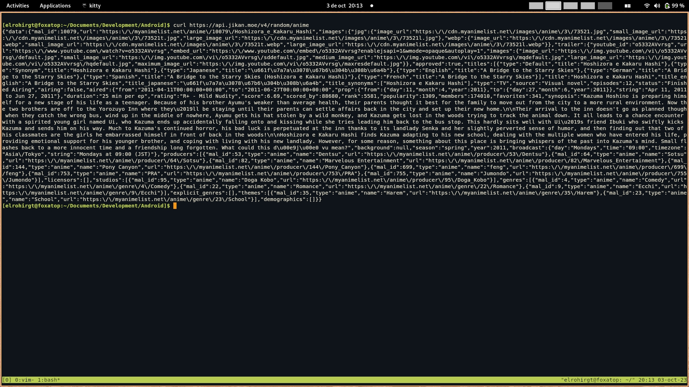
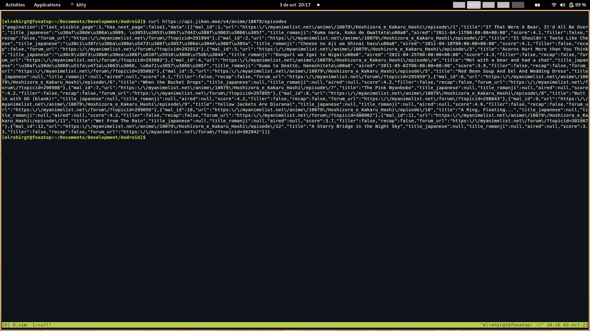

# Laboratorio 05
Aplicación móvil que muestra un anime random de MyAnimeList (MAL) y su lista de episodios.

Puedes ver un [video de la app funcionando]() en Youtube.

## API
La API utilizada para obtener los datos se llama Jikan, no requiere ninguna clase de token de autenticación. Las principales rutas que se usarán son:

- [**getRandomAnime**](https://docs.api.jikan.moe/#tag/random/operation/getRandomAnime): Ruta que obtiene un anime random desde la API.

- [**getAnimeEpisodes**](https://docs.api.jikan.moe/#tag/anime/operation/getAnimeEpisodes): Ruta que obtiene una lista con todos los episodios del anime que se pasa por parámetro.

