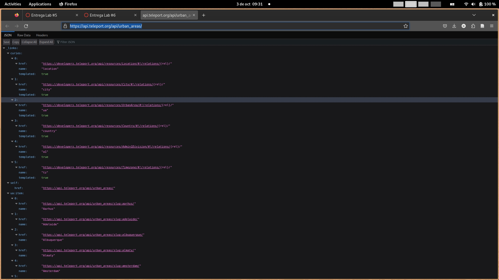
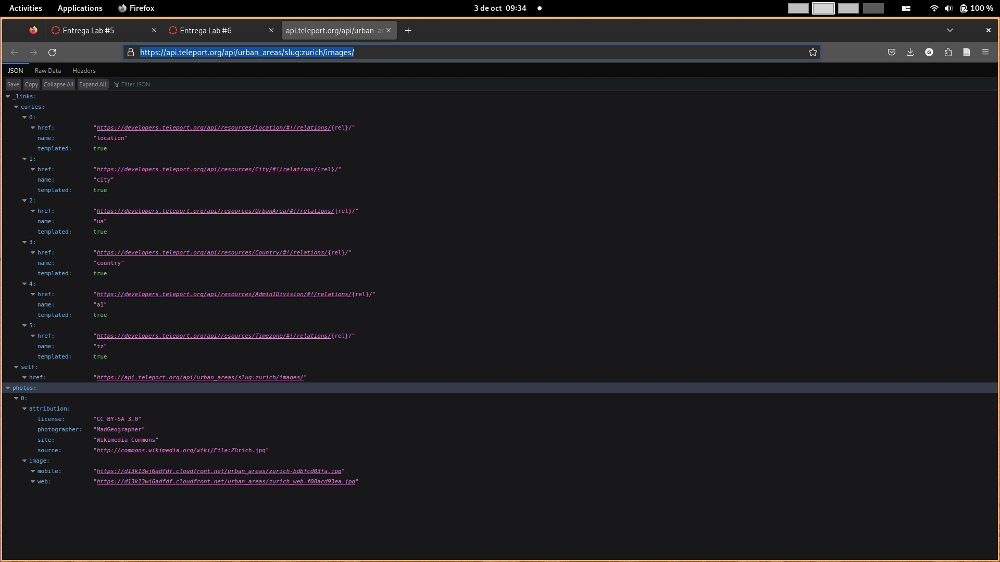

# Laboratorio 06

Para este laboratorio se tenía que realizar una app cliente de la [API de Teleport](http://developers.teleport.org/api/reference/).

## Rutas usadas
Se usaron unas cuantas rutas, las cuales son:
- [GET /urban_areas](https://api.teleport.org/api/urban_areas/): Esta ruta fue utilizada para obtener la información de las ciudades, como su nombre e ID. Esta ruta es clave para mostrar el listado inicial con todas las ciudades que tiene disponible la API.

- [GET /urban_areas/slug:${city name}/images](https://api.teleport.org/api/urban_areas/slug:zurich/images/): Esta ruta fue utilizada para obtener las urls de las imágenes. Como se puede ver por la imagen de abajo, es posible que hayan ciudades con más de una imagen disponible, por lo que el cliente tiene que tomar esto en cuenta y poder mostrarlas todas.

